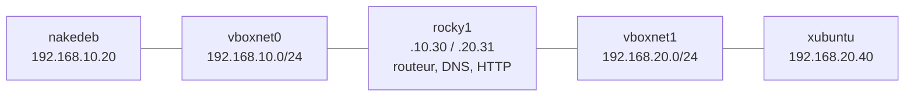

# Administration Unix — TP 11 à 19

Travaux pratiques d'administration GNU/Linux réalisés dans un laboratoire VirtualBox composé de Xubuntu, NakeDeb/Debian et Rocky Linux.

L'objectif du dépôt est double : répondre aux objectifs techniques des séances et présenter une démarche reproductible, vérifiable et prudente. Les scripts restent volontairement lisibles : Bash strict, variables explicites, contrôles avant modification et commandes de vérification après chaque étape.

## Contenu

| TP | Sujet | Livrables principaux |
|---:|---|---|
| 11 | Xubuntu dans VirtualBox | procédure d'installation, collecte d'informations |
| 12 | Utilisateurs et groupes | création/suppression depuis un fichier, audits simples |
| 13 | ACL, setuid et setgid | laboratoire ACL, scanner de droits spéciaux, démonstration EUID |
| 14 | NakeDeb et LVM | plan de partitionnement, extension contrôlée de `/home` |
| 15 | Paquets Debian | inventaire, comparaison et construction manuelle d'un `.deb` |
| 16 | `at`, `cron`, `systemd` | scripts différés, nettoyage et service ROT13 |
| 17 | Réseau virtuel | deux réseaux host-only et routage entre trois VMs |
| 18 | Persistance, SSH et DNS | profils NetworkManager, comptes cohérents et zone BIND |
| 19 | HTTP, SSHFS et pare-feu | Apache, montage utilisateur, firewalld et fail2ban |

## Topologie cible



## Utilisation

1. Créer un instantané VirtualBox avant chaque TP qui modifie le système.
2. Lire le `README.md` du TP concerné.
3. Adapter uniquement les variables annoncées : noms des VMs, interfaces et utilisateurs.
4. Exécuter les commandes dans la VM indiquée, jamais directement sur le poste hôte.
5. Conserver les sorties demandées à l'aide du modèle [`docs/PREUVES.md`](docs/PREUVES.md).

Validation statique du dépôt :

```bash
make check
```

La commande vérifie la syntaxe Bash, lance ShellCheck s'il est installé, compile les sources C sans produire d'exécutable et construit le paquet de démonstration dans un répertoire temporaire.

## Périmètre de sécurité

Les TP touchent aux comptes, aux disques, au routage et aux privilèges. Les scripts destructifs fonctionnent en mode simulation par défaut ou exigent une option explicite. Le dépôt ne publie pas de shell root setuid : la démonstration affiche uniquement les UID réel et effectif, ce qui prouve le mécanisme sans créer de porte dérobée réutilisable.

## Référence pédagogique

Les objectifs sont adaptés du cours d'[Administration Unix d'Édouard Thiel](https://pageperso.lis-lab.fr/~edouard.thiel/ens/adunix/). Les explications et les implémentations de ce dépôt sont reformulées et complétées pour former un laboratoire reproductible.

Auteur : Mohamed Saaoudi
